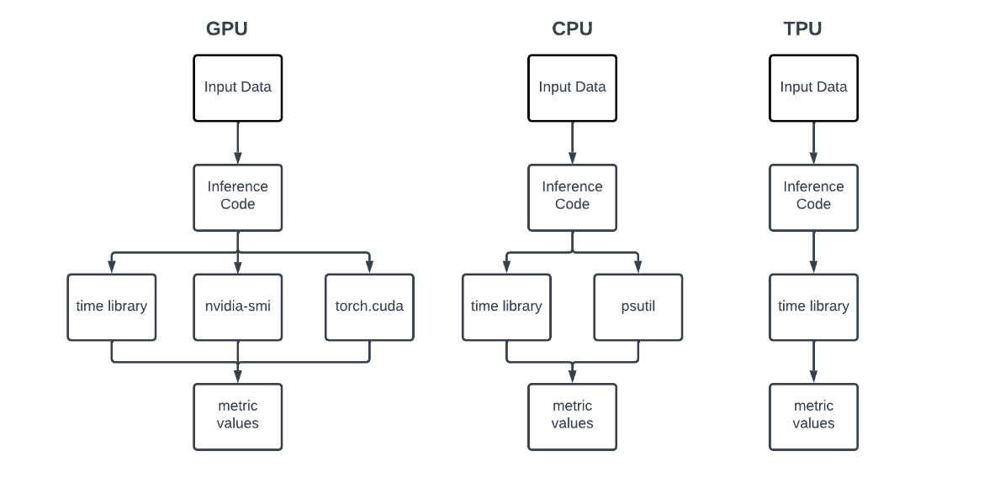

# Benchmarking CPU, GPU, and TPU

## Introduction
The increasing use of deep learning models for various applications necessitates efficient and fast computation. Therefore, the evaluation and comparison of different computing platforms' performance is essential to understand their strengths and limitations. This study focuses on benchmarking the performance of CPU, GPU, and TPU platforms using pre-trained ImageNet models. The results provide insights into each platform's strengths and weaknesses. They help in making informed decisions regarding the selection of the appropriate platform for specific applications. Benchmarking deep learning platforms has several challenges. For instance, the choice of software framework, optimization techniques, and hyperparameters can significantly affect the results. This study discusses the challenges associated with benchmarking deep learning platforms and makes recommendations for future research.

## Methodology
Our goal is to perform inference on pre-trained ImageNet models using CPU, GPU, and TPU devices. This is accomplished by developing a Python framework that generates random image data according to specified batch sizes and precisions. Using this framework, we feed pre-trained models with generated image data and record various device metrics, such as inference time, communication time, and device utilization. We investigate each device's performance under different conditions by varying several key parameters. 

- We evaluate the performance of CPU, GPU, and TPU devices for conducting inference on pre-trained ImageNet models.
- We vary key parameters, including batch size, data precision, and number of inference steps, to assess how each device performs under different conditions.
- We use the same pre-trained ImageNet models and data for each test to isolate the impact of hardware on model performance.

| Variations             | CPU                     | GPU                                         | TPU                                         |
|-----------------------|-------------------------|---------------------------------------------|---------------------------------------------|
| Data Precision         | float32, float64        | float16, bfloat16, float32, float64          | float16, bfloat16, float32, float64          |
| Number of Inference Steps | 512,1024             | 512,1024                                    | 32                                          |
| Batch Size             | 16,32,64                | 16,32,64                                    | 16,32,64                                    |

