# Benchmarking CPU, GPU, and TPU

## Introduction
The increasing use of deep learning models for various applications necessitates efficient and fast computation. Therefore, the evaluation and comparison of different computing platforms' performance is essential to understand their strengths and limitations. This study focuses on benchmarking the performance of CPU, GPU, and TPU platforms using pre-trained ImageNet models. The results provide insights into each platform's strengths and weaknesses. They help in making informed decisions regarding the selection of the appropriate platform for specific applications. Benchmarking deep learning platforms has several challenges. For instance, the choice of software framework, optimization techniques, and hyperparameters can significantly affect the results. This study discusses the challenges associated with benchmarking deep learning platforms and makes recommendations for future research.

## Methodology
Our goal is to perform inference on pre-trained ImageNet models using CPU, GPU, and TPU devices. This is accomplished by developing a Python framework that generates random image data according to specified batch sizes and precisions. Using this framework, we feed pre-trained models with generated image data and record various device metrics, such as inference time, communication time, and device utilization. We investigate each device's performance under different conditions by varying several key parameters. 

- We evaluate the performance of CPU, GPU, and TPU devices for conducting inference on pre-trained ImageNet models.
- We vary key parameters, including batch size, data precision, and number of inference steps, to assess how each device performs under different conditions.
- We use the same pre-trained ImageNet models and data for each test to isolate the impact of hardware on model performance.

| Variations             | CPU                     | GPU                                         | TPU                                         |
|-----------------------|-------------------------|---------------------------------------------|---------------------------------------------|
| Data Precision         | float32, float64        | float16, bfloat16, float32, float64          | float16, bfloat16, float32, float64          |
| Number of Inference Steps | 512,1024             | 512,1024                                    | 32                                          |
| Batch Size             | 16,32,64                | 16,32,64                                    | 16,32,64                                    |

|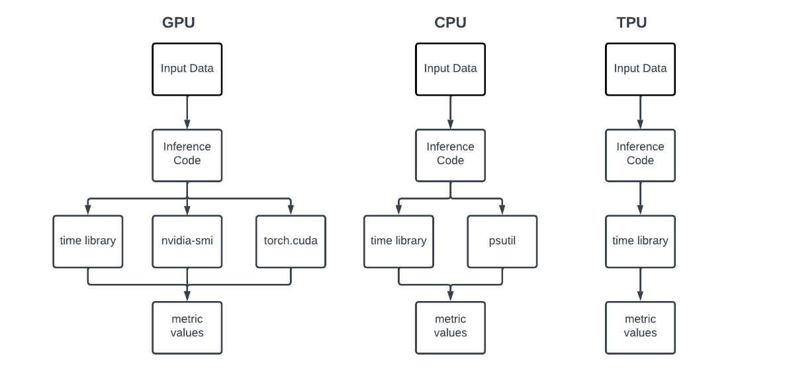|
|:--:| 
| *Steps for measuring metrics for CPU, TPU, and GPU* |

## Hardware Platforms
Our selection of hardware platforms varies widely on the devices that are available to us when the following experiments are done. 

**CPU Platform1 (CPUv1)** 

This CPU is a Intel(R) Core(TM) i7-8750H CPU. It has 6 cores and 12 threads. It has 16GB DDR4 memory and a peak FLOPS of 2.2 GHz x 6 cores x 2 FLOPS/cycle = 26.4 GFLOPS. 

**CPU Platform2 (CPUv2)** 

This CPU is an AMD EPYC 7763 64-Core Processor and is a server-grade CPU based on the Zen 3 architecture. It has 64 cores and 128 threads. It has 256GB DDR-4 and a peak FLOPS of 4.95 teraflops (single precision) and 2.475 teraflops (double precision). 

**GPU Platform**

This GPU is an NVIDIA A100-PCIE-40GB a high-performance GPU designed for use in data centers and scientific computing applications. It has 40GB HBM2 GPU memory, with high-bandwidth memory operating at up to 2TB/s. It has a peak performance of 9.7 TFlops in double precision and 312 TFlops in FP16 precision using the Tensor Cores. It has the AMD EPYC 7763 64-Core Processor as the host which communicates with the GPU. 

**TPU Platform**

This is the Google collab TPU platform that is accessible to the public. We use the TPU v2 of the google collab TPUs \cite{b3} which supports 45 TFLOPS (mixed precision) and 2 cores. Total ML acceleration for a Cloud TPU v2 platform is 180 TFLOPS. Memory size is 8 GB per core, or 64 GB per board, with 2400 GB/s overall memory bandwidth.

| Platform | Mem Type | Memory (GB) | Mem Bdw | Peak FLOPS |
| --- | --- | --- | --- | --- |
| CPUv1 | DDR4 | 16 | 41.8 GB/s | 26.4G SP* |
| CPUv2 | DDR4 | 256 | 204.8 GB/s | 4.95T SP* |
| GPU | HBM2 | 40 | 2 TB/s | 9.7T DP** |
| TPU v2 | HBM | 8 | 2400 GB/s | 180T |

\* SP - Single Precision, ** DP - Double Precision

## Results

### CPUv1 to CPUv2

#### Inference time and Speed up
|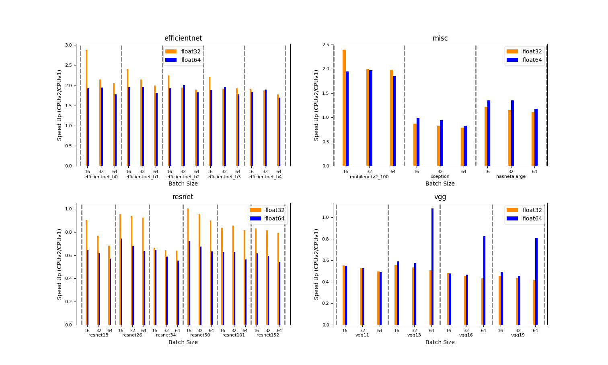|
|:--:| 
|*Inference time CPUv1 vs CPUv2*|
#### CPU Utilization and Memory Usage
|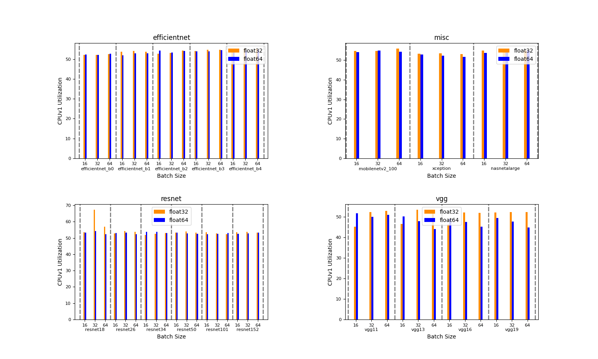|
|:--:| 
|*CPUv1 Utilization*|
|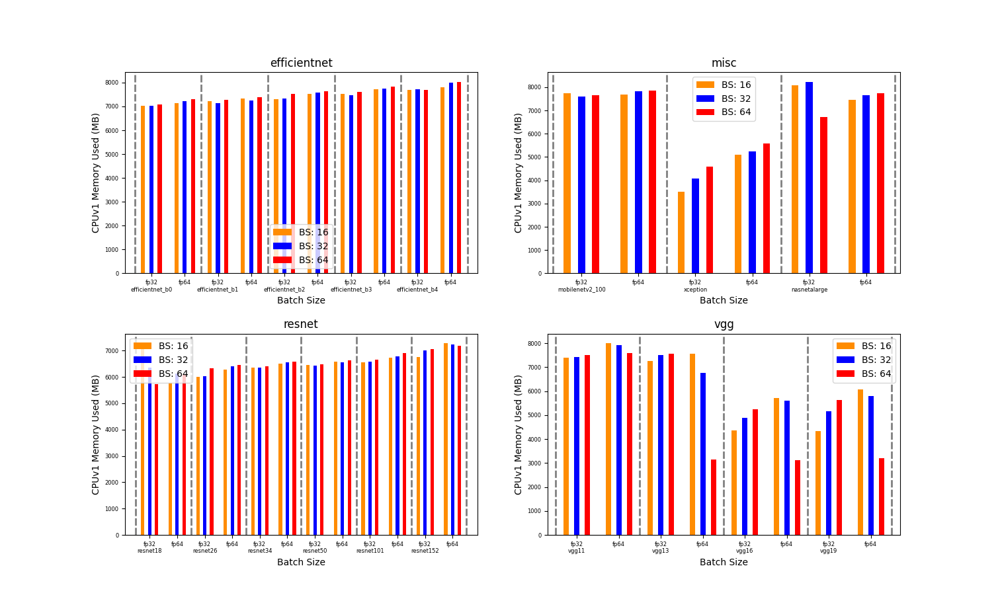|
|*CPUv1 Memory Usage*|
|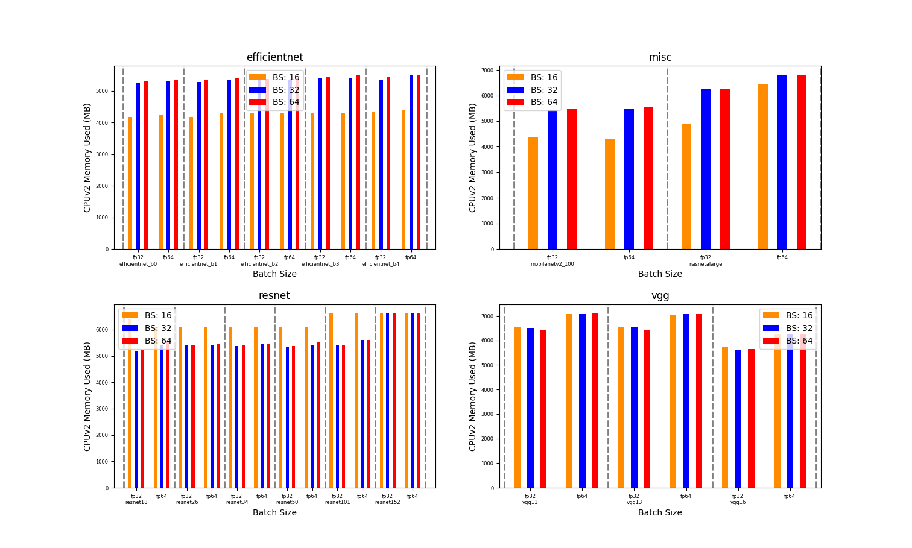|
|*CPUv2 Memory Usage*|

### CPUv2 Vs GPU

#### Inference Time and Speed Up
|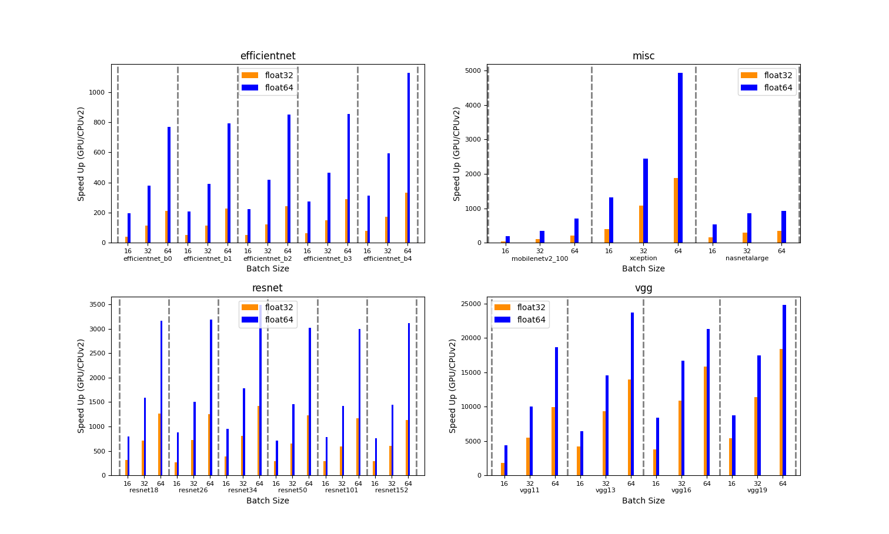|
|:--:| 
|*Inference time CPUv2 vs GPU*|
#### Device Utilization
|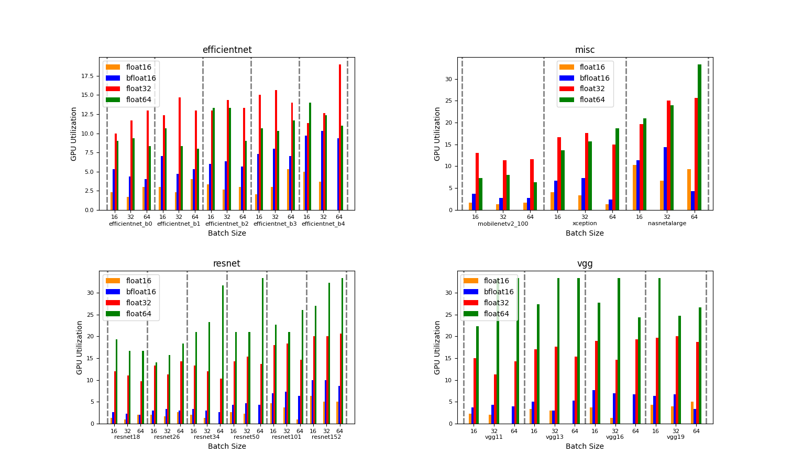|
|:--:| 
|*GPU Utilization*|
#### GPU Power Consumption
|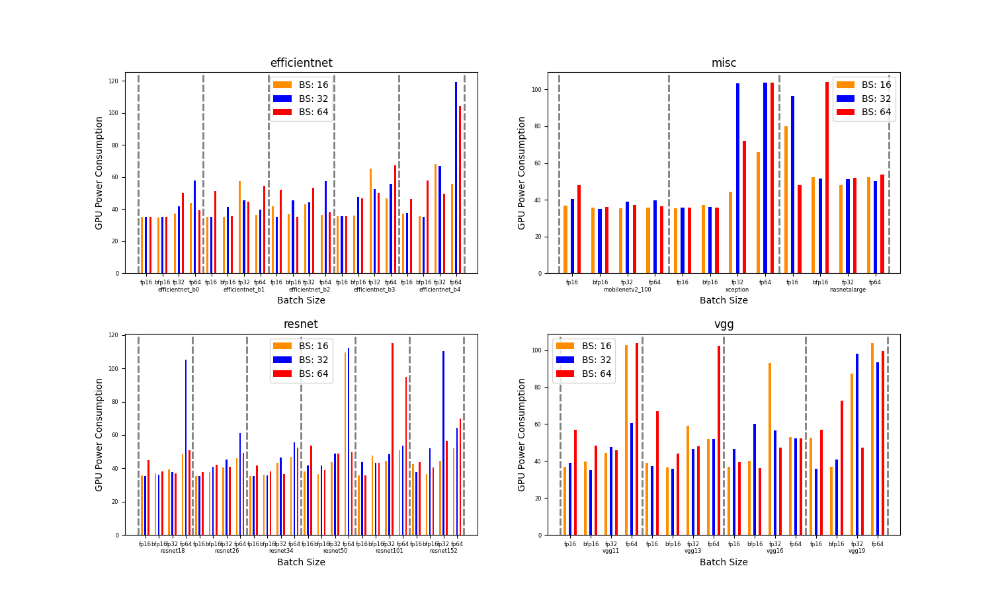|
|:--:| 
|*GPU Power Consumption*|

### CPU Vs TPU

#### Inference Time and Speed Up
|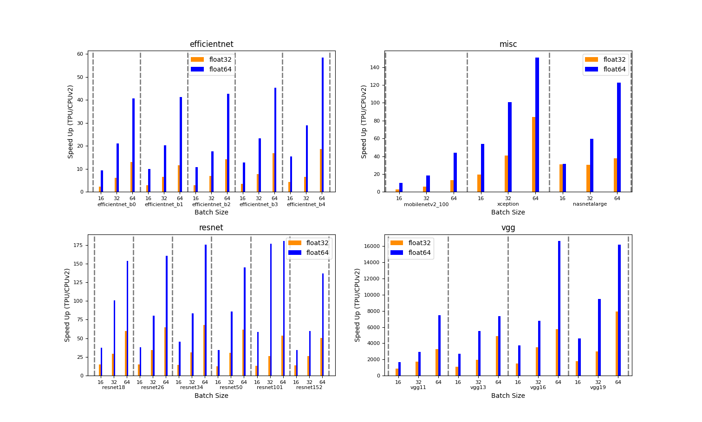|
|:--:| 
|*Inference time CPUv2 vs TPU*|

### GPU Vs TPU

#### Inference Time and Speed Up
|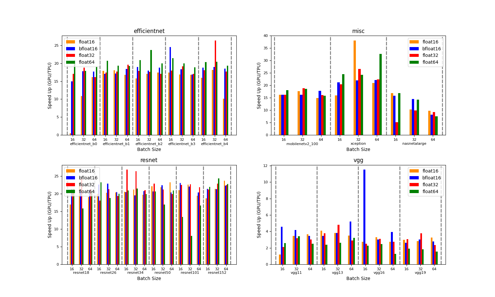|
|:--:| 
|*Inference time GPU vs TPU*|
#### Communication Time
|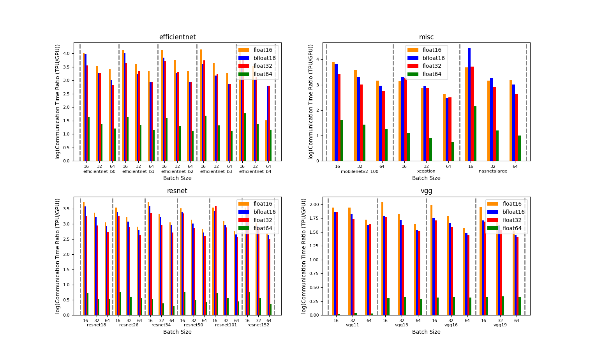|
|:--:| 
|*Communication time GPU vs TPU*|

## Conclusion

This paper presents a comprehensive study of the CPU, GPU, and TPU platforms using pre-trained ImageNet models. The performance of these platforms is evaluated based on their inference time, communication time, utilization, and power consumption, and the results are analyzed and compared for varying batch sizes and data precision types.

Our findings reveal that GPUs are the most effective platform for deep learning inference tasks on ImageNet, followed by TPUs and CPUs. Specifically, we observed a 744.41x speedup with the GPU (NVIDIA A100) compared to the CPU (AMD EPYC 7763 64-Core), and a 48.28x speedup with the TPU (Google Colab TPU v2) compared to the same CPU. While the GPU provides a 15.42x speedup in inference time compared to the TPU, the optimal platform choice depends on the specific needs of the application.

We observed a power consumption increase of 1.11x and 1.02x as we moved from batch size 16 to 32 and 32 to 64, respectively, for the GPU. Furthermore, changing the data precision from fp16 to bfp16 increased power consumption by 1.01x, while changing it from fp16 to fp32 and fp32 to fp64 increased the power consumption of the GPU by 1.28x and 1.20x, respectively.

This study also observed that GPUs are the best hardware platforms for ML inferences with smaller batch sizes, and with higher batch sizes, TPUs can become the leading accelerators for these ML inference jobs. This study contributes to the existing literature on hardware benchmarking for deep learning tasks and can help inform the development of more efficient hardware architectures for these tasks.

Future work could expand this study by evaluating additional hardware platforms or by exploring the performance of these platforms using different deep-learning models or datasets. Additionally, this study only evaluated the performance of these platforms for inference tasks; future work could also explore their performance for training tasks.

Overall, this study provides valuable insights into the performance of CPU, GPU, and TPU platforms for deep learning tasks and can help inform the development of more efficient hardware platforms for these tasks.

## References

1. Abadi, M., Barham, P., Chen, J., Chen, Z., Davis, A., Dean, J., … Zheng, X. (2016). TensorFlow: A System for Large-Scale Machine Learning. In K. Keeton & T. Roscoe (Eds.), 12th USENIX Symposium on Operating Systems Design and Implementation, OSDI 2016, Savannah, GA, USA, November 2-4, 2016 (pp. 265–283).
2. Paszke, A., Gross, S., Massa, F., Lerer, A., Bradbury, J., Chanan, G., … Chintala, S. (2019). PyTorch: An Imperative Style, High-Performance Deep Learning Library. In H. M. Wallach, H. Larochelle, A. Beygelzimer, F. d’Alché-Buc, E. B. Fox, & R. Garnett (Eds.), Advances in Neural Information Processing Systems 32: Annual Conference on Neural Information Processing Systems 2019, NeurIPS 2019, December 8-14, 2019, Vancouver, BC, Canada (pp. 8024–8035).
3. Jouppi, Norman P., et al. ‘In-Datacenter Performance Analysis of a Tensor Processing Unit’. Proceedings of the 44th Annual International Symposium on Computer Architecture, ISCA 2017, Toronto, ON, Canada, June 24-28, 2017, ACM, 2017, pp. 1–12, https://doi.org10.1145/3079856.3080246.
4. AMD EPYC 7763 64-Core Processor https://www.amd.com/en/products/cpu/amd-epyc-7763
5. Wang, Y., Wei, G.-Y., & Brooks, D. (2019). Benchmarking TPU, GPU, and CPU Platforms for Deep Learning. CoRR, abs/1907.10701. Retrieved from http://arxiv.org/abs/1907.10701
6. Elordi, U., Unzueta, L., Goenetxea, J., Sanchez-Carballido, S., Arganda-Carreras, I., & Otaegui, O. (2021). Benchmarking Deep Neural Network Inference Performance on Serverless Environments With MLPerf. IEEE Softw., 38(1), 81–87. doi:10.1109/MS.2020.3030199
7. Hodak, M., Ellison, D., & Dholakia, A. (2021). Everyone is a Winner: Interpreting MLPerf Inference Benchmark Results. In R. Nambiar & M. Poess (Eds.), Performance Evaluation and Benchmarking - 13th TPC Technology Conference, TPCTC 2021, Copenhagen, Denmark, August 20, 2021, Revised Selected Papers (pp. 50–61). doi:10.1007/978-3-030-94437-7\_4
8. Liu, L., & Deng, J. (2018). Dynamic Deep Neural Networks: Optimizing Accuracy-Efficiency Trade-Offs by Selective Execution. In S. A. McIlraith & K. Q. Weinberger (Eds.), Proceedings of the Thirty-Second AAAI Conference on Artificial Intelligence, (AAAI-18), the 30th innovative Applications of Artificial Intelligence (IAAI-18), and the 8th AAAI Symposium on Educational Advances in Artificial Intelligence (EAAI-18), New Orleans, Louisiana, USA, February 2-7, 2018 (pp. 3675–3682). Retrieved from https://www.aaai.org/ocs/index.php/AAAI/AAAI18/paper/view/16291
9. Reddi, V. J., Cheng, C., Kanter, D., Mattson, P., Schmuelling, G., Wu, C.-J., … Zhou, Y. (2019). MLPerf Inference Benchmark. CoRR, abs/1911.02549. Retrieved from http://arxiv.org/abs/1911.02549
10. Krizhevsky, A., Sutskever, I., & Hinton, G. E. (2017). ImageNet classification with deep convolutional neural networks. Commun. ACM, 60(6), 84–90. doi:10.1145/3065386
11. Razavian, A. S., Azizpour, H., Sullivan, J., & Carlsson, S. (2014). CNN Features Off-the-Shelf: An Astounding Baseline for Recognition. IEEE Conference on Computer Vision and Pattern Recognition, CVPR Workshops 2014, Columbus, OH, USA, June 23-28, 2014, 512–519. doi:10.1109/CVPRW.2014.131
12. Jouppi, N. P., Kurian, G., Li, S., Ma, P. C., Nagarajan, R., Nai, L., … Patterson, D. A. (2023). TPU v4: An Optically Reconfigurable Supercomputer for Machine Learning with Hardware Support for Embeddings. CoRR, abs/2304.01433. doi:10.48550/arXiv.2304.01433
13. Shahid, A., & Mushtaq, M. (2020). A Survey Comparing Specialized Hardware And Evolution In TPUs For Neural Networks. 2020 IEEE 23rd International Multitopic Conference (INMIC), 1–6. doi:10.1109/INMIC50486.2020.9318136

